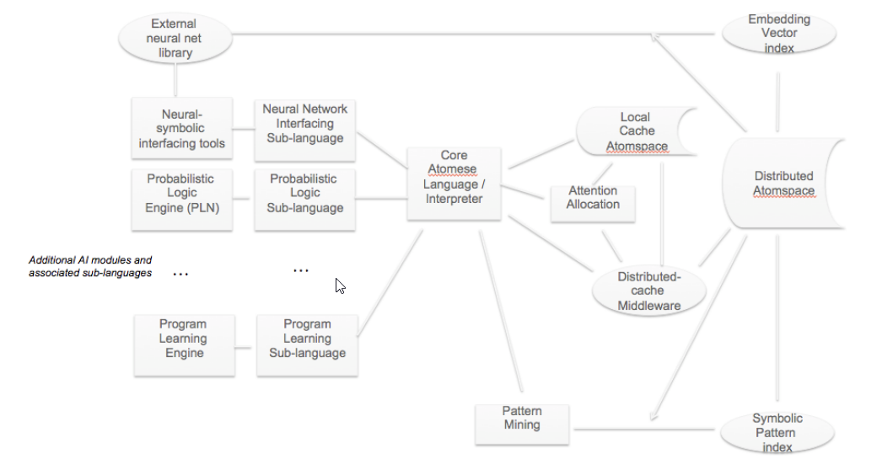

**How OpenCog Hyperon Can Be the Framework for Artificial General Intelligence (AGI)**

OpenCog Hyperon is an evolution of the original OpenCog framework, designed to address the complexities and scalability needs required for AGI. It builds on the strengths of OpenCog but introduces new architecture and components to make AGI development more feasible.

---

### 1. **The Original OpenCog Framework**

**OpenCog**, launched in 2008, was an open-source framework aimed at AGI research. Its core components were:

- **Atomspace:** A hypergraph knowledge store where AI agents could store and retrieve knowledge.
- **Cognitive Synergy:** Multiple AI agents worked together in parallel, sharing knowledge through Atomspace to tackle different aspects of intelligence.
- **AI Agents:** These included probabilistic logic (PLN), evolutionary learning (MOSES), and attention systems. Each handled specific cognitive tasks.

**Challenges in OpenCog:**
- The **Pattern Matcher** was over-relied upon for inference and reasoning tasks, limiting efficiency.
- **Scalability** was a problem, as Atomspace was designed for single machines.
- Integration with **neural networks** was awkward, slowing development in hybrid AI systems.

---

### 2. **OpenCog Hyperon: A New Approach for AGI**

OpenCog Hyperon want to fix these issues by providing better scalability, integration, and flexibility. It keeps the original ideas but modernizes the system.

#### Key Components and How They Work

1. **Atomspace 2 (Metagraph)**
   - **Distributed Knowledge Store:** Atomspace is now distributed across multiple machines, allowing it to handle vast data sets essential for AGI.
   - **Efficient Data Management:** It uses a new structure called metagraphs, which allows more complex relationships and faster reasoning.

2. **Atomese 2**
   - **Programming Language for AGI:** Atomese 2 is the language used to manipulate Atomspace. It’s now more robust and scalable, with a human-friendly syntax for easier development.
   - **Two Layers:**
     - **Core Layer:** Handles basic atom manipulations and type definitions.
     - **AI-Specific Layer:** Designed for AI tasks, allowing more complex and efficient logic and learning.
   - **Pattern Matching:** Atomese 2 breaks pattern matching into smaller tasks, improving efficiency, especially in distributed systems.

3. **Distributed Processing**
   - **Middleware:** Coordinates Atomspace across many machines, making it highly scalable. This system allows AGI to process massive data sets quickly and efficiently.
   - **Handling Inconsistencies:** Hyperon balances between consistency and performance, essential for complex AGI tasks where speed is critical.

4. **AI Agents and Cognitive Synergy**
   - **Multiple Agents, One Knowledge Store:** Like the original, Hyperon allows AI agents to collaborate through Atomspace, improving cognitive synergy.
   - **Neural-Symbolic Integration:** Hyperon handles symbolic reasoning and neural networks smoothly, blending data-driven AI and logical inference.

---

### 3. **Why OpenCog Hyperon is Fit for AGI**

1. **Scalability:** Distributed Atomspace allows the system to handle the enormous amounts of data and computations AGI requires.
2. **Integration of Multiple AI Paradigms:** Hyperon effectively combines symbolic reasoning, probabilistic learning, and neural networks.
3. **Efficient Reasoning:** Atomese 2 improves reasoning and pattern matching, allowing the system to tackle complex, high-level cognitive tasks.
4. **Modularity and Flexibility:** The architecture is adaptable to future AI developments, ensuring its longevity as an AGI framework.

---
